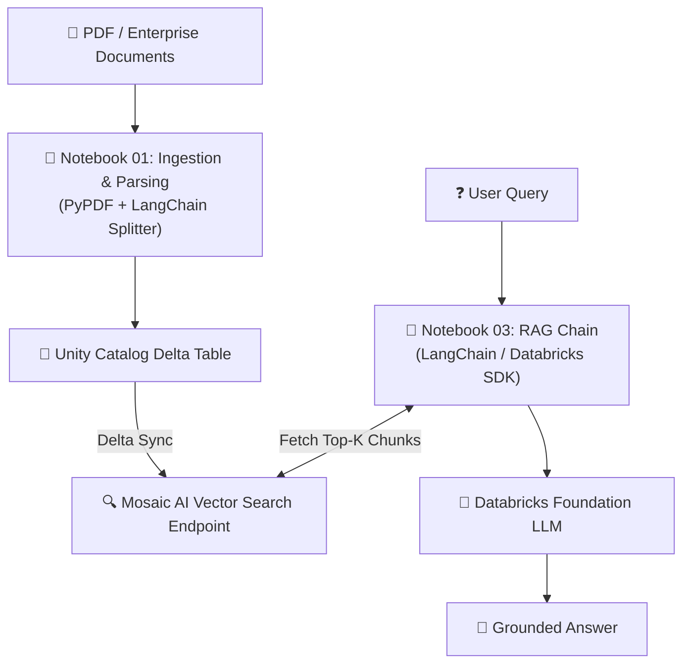

# 🤖 Enterprise RAG on Databricks: End-to-End Document Q&A Pipeline

[](https://databricks.com)
[](https://docs.databricks.com/data-governance/unity-catalog/)
[](https://mlflow.org)
[](https://www.python.org)

An end-to-end, production-ready **Retrieval-Augmented Generation (RAG)** pipeline built natively on **Azure Databricks**. This project demonstrates how to turn unstructured documents (PDFs, text data) into an enterprise-grade Q&A system using **Mosaic AI Vector Search**, **Delta Lake**, **Unity Catalog**, **MLflow**, and **Databricks Foundation Model APIs**.

---

## 📌 Project Overview

Standard Large Language Models (LLMs) cannot access private enterprise documents and are prone to hallucinations. This repository solves that challenge by implementing a complete **RAG architecture** directly inside the Databricks Lakehouse environment.

### Why This Architecture?
- **Native Vector Search**: Continuously auto-syncs embeddings from Unity Catalog Delta Tables without external vector databases.
- **Unified Governance**: Uses Databricks **Unity Catalog** to secure raw data, text chunks, embeddings, and registered models.
- **Full Observability**: Integrated with **MLflow Tracing** to track retrieval performance, prompts, and response latency.
- **Serverless & Scalable**: Uses Databricks Foundation Model Endpoints for fast, cost-effective LLM inference.

---

## 🏗️ System Architecture



```text
+------------------------------+
|  PDF / Enterprise Documents  |
+------------------------------+
               │
               ▼
+-------------------------------------------------------+
| Notebook 01: Ingestion & Parsing                      |
| (PyPDF + LangChain Splitter)                          |
+-------------------------------------------------------+
               │
               ▼
+------------------------------+       (Delta Sync)       +----------------------------------+
|  Unity Catalog Delta Table   | ───────────────────────► | Mosaic AI Vector Search Endpoint |
+------------------------------+                          +----------------------------------+
                                                                          ▲
                                                                          │ Top-K Chunks
+------------------------------+                                          │
|          User Query          |                                          │
+------------------------------+                                          │
               │                                                          │
               ▼                                                          │
+-------------------------------------------------------------------------┴------------------+
|                         Notebook 03: RAG Chain (LangChain / Databricks SDK)               |
+-------------------------------------------------------------------------┬------------------+
                                                                          │
                                                                          ▼
                                                        +-----------------------------------+
                                                        |    Databricks Foundation LLM      |
                                                        +-----------------------------------+
                                                                          │
                                                                          ▼
                                                        +-----------------------------------+
                                                        |          Grounded Answer          |
                                                        +-----------------------------------+
```

## 📂 Notebook Breakdown & Workflow

The pipeline is split into four clean, modular notebooks designed for simple execution and demonstration:

### 1️⃣ `01_data_ingestion_and_chunking.ipynb`
- **Goal**: Parse raw unstructured documents into structured text chunks.
- **Key Steps**:
  - Loads PDF documents stored in **Databricks Unity Catalog Volumes** (`/Volumes/...`).
  - Extracts text content page by page using `pypdf`.
  - Applies LangChain's `RecursiveCharacterTextSplitter` (`chunk_size=1000`, `chunk_overlap=200`).
  - Stores chunks with page metadata into a Delta Table governed by Unity Catalog.

### 2️⃣ `02_vector_search_and_indexing.ipynb`
- **Goal**: Create and manage a high-performance vector index on Databricks.
- **Key Steps**:
  - Initializes a Databricks **Mosaic AI Vector Search Endpoint**.
  - Configures a **Delta Sync Index** linked directly to the Delta Table created in Step 1.
  - Automatically computes and updates high-dimensional embeddings using Databricks managed embedding models (e.g., `databricks-bge-large-en`).

### 3️⃣ `03_rag_pipeline_and_langchain.ipynb`
- **Goal**: Build the retrieval and response generation chain.
- **Key Steps**:
  - Connects to the Vector Search index using `DatabricksVectorSearch`.
  - Formulates structured prompts to enforce strict context-grounded responses (minimizing hallucinations).
  - Queries Databricks Foundation Models (e.g., `databricks-meta-llama-3-1-70b-instruct`).
  - Runs end-to-end natural language Q&A with source document citations.

### 4️⃣ `04_model_evaluation_and_mlflow.ipynb`
- **Goal**: Evaluate quality, trace execution, and register the pipeline.
- **Key Steps**:
  - Leverages `mlflow.langchain.autolog()` for full visual tracing of prompts, context retrieval, and generation steps.
  - Evaluates answer relevance and faithfulness.
  - Registers the final model into **Unity Catalog Model Registry** for deployment via Model Serving.

---

## 🛠️ Tech Stack

| Domain | Tools & Technologies |
| :--- | :--- |
| **Data Platform** | Azure Databricks (Runtime 14.3+ ML) |
| **Governance & Storage** | Unity Catalog, Volumes, Delta Lake |
| **Vector DB** | Databricks Mosaic AI Vector Search |
| **Orchestration** | LangChain, `databricks-langchain` |
| **Models** | Databricks Foundation Model APIs (`databricks-bge-large-en`, `meta-llama-3-1-70b`) |
| **MLOps & Tracking** | MLflow Tracing & Unity Catalog Model Registry |

---

## 🚀 How to Run

### Prerequisites
1. An active Databricks Workspace with **Unity Catalog** enabled.
2. Serverless compute or a cluster running **Databricks Runtime 14.3+ ML**.
3. Access to Databricks Vector Search and Foundation Model endpoints.

### Installation
Clone this repository directly into your Databricks Workspace:

```bash
git clone [https://github.com/prajwalreddy04/rag_on_databricks.git](https://github.com/prajwalreddy04/rag_on_databricks.git)

%pip install --upgrade databricks-vectorsearch databricks-langchain langchain pypdf mlflow
dbutils.library.restartPython()


